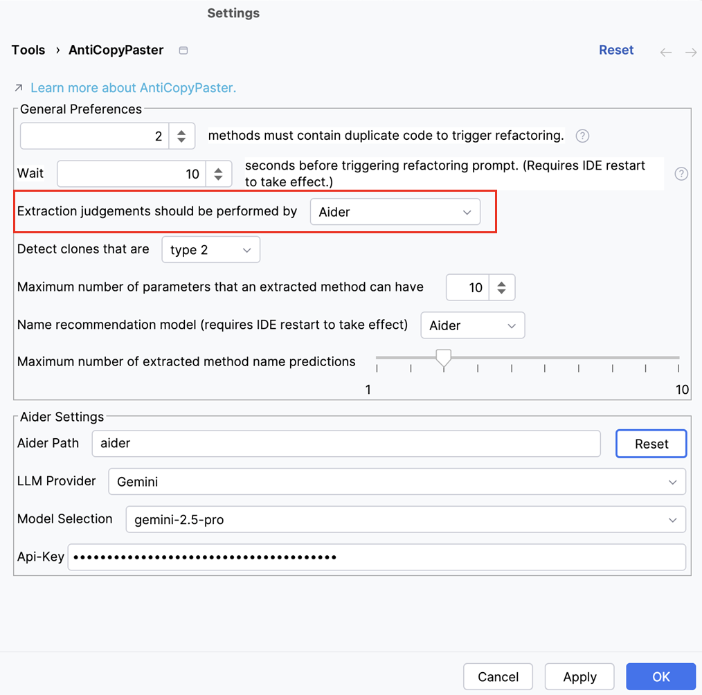
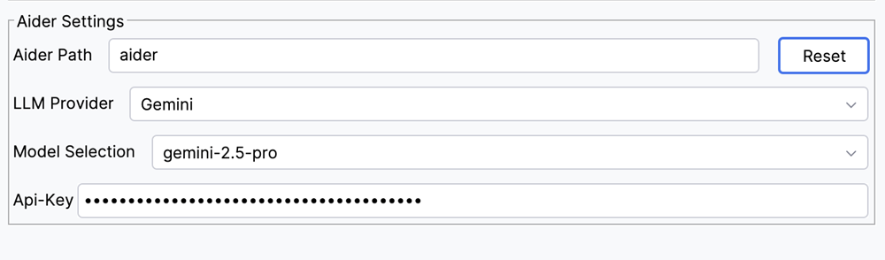
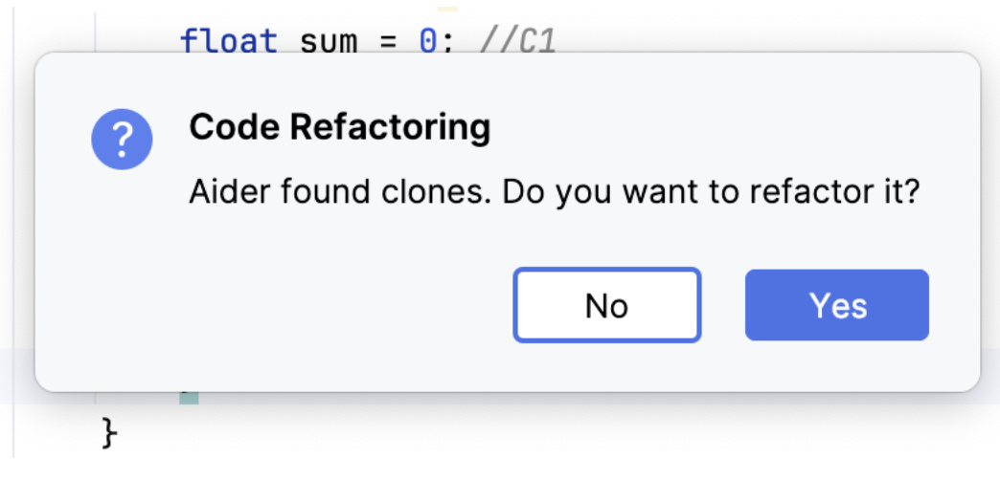
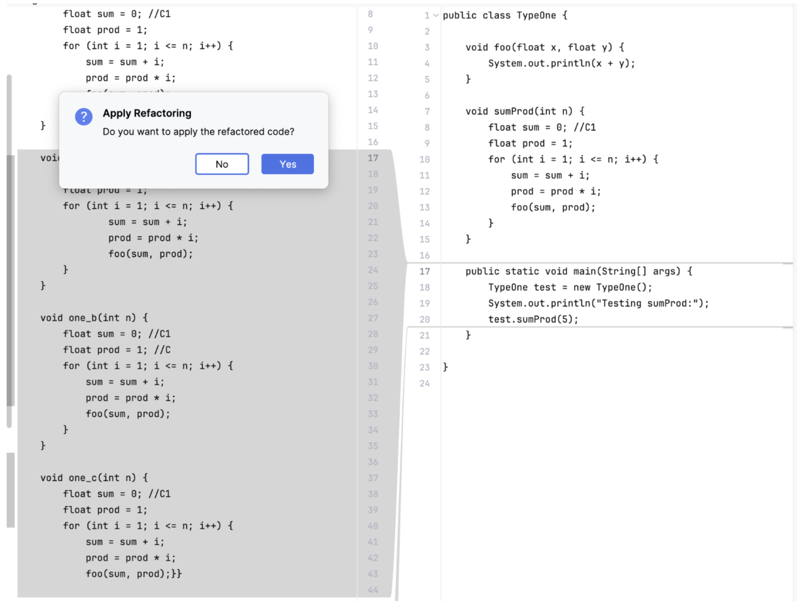
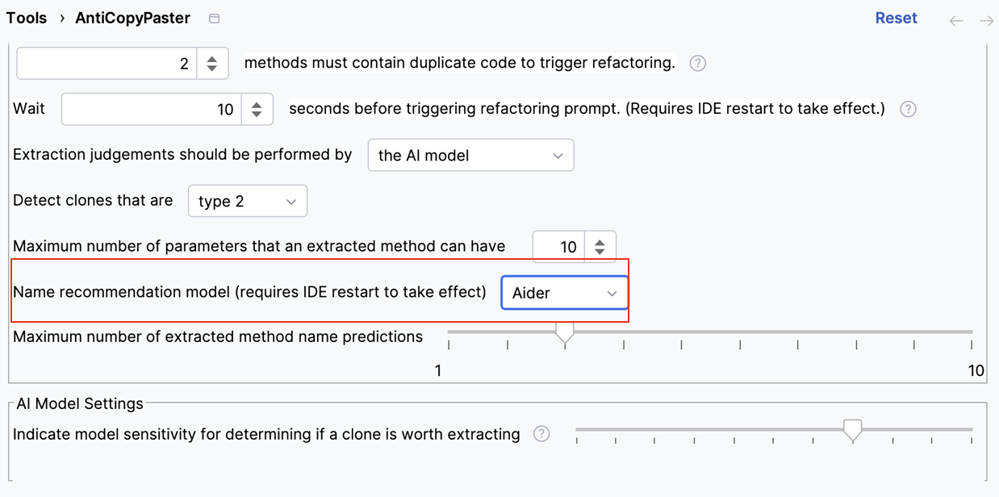
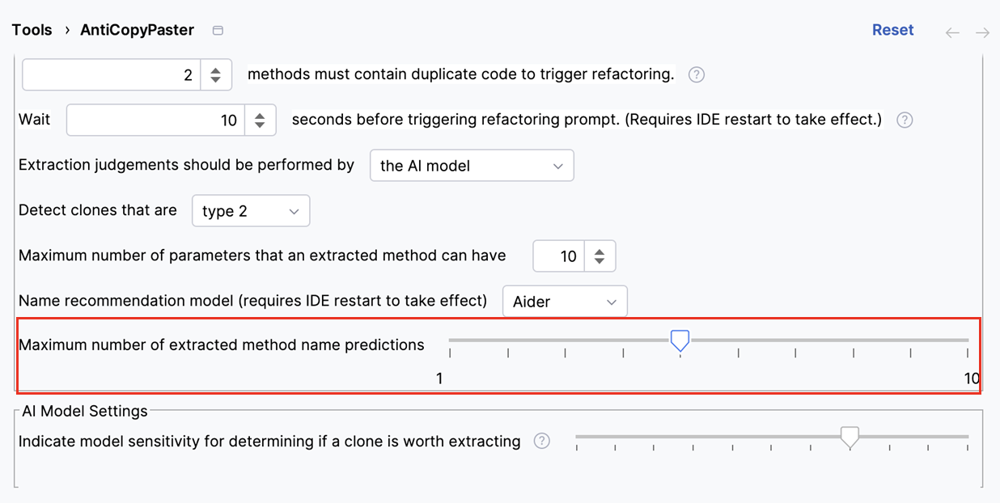
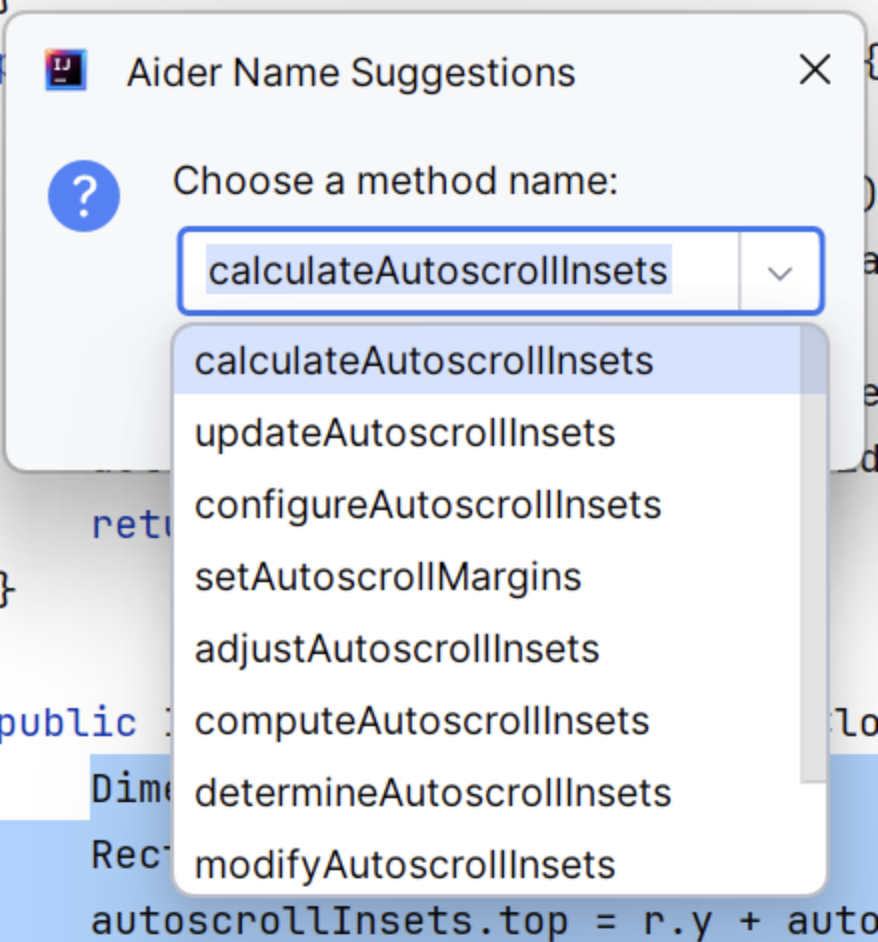

# AntiCopyPaster

AntiCopyPaster is a plugin for IntelliJ IDEA that tracks the copying and pasting carried out by the developer and
suggests extracting duplicates into a new method as soon as they are introduced in the code.

> **Warning**: Please note that AntiCopyPaster is a prototype and a work in progress. We appreciate any feedback
> on both the concept itself and its implementation.

## How To Install

AntiCopyPaster requires IntelliJ IDEA version 2023.2 to work. To install the plugin:

1. Download the pre-built version of the plugin from 
   [here](https://sourceforge.net/projects/anti-copy-paster/files/latest/download).
2. Open IntelliJ IDEA and go to `File`/`Settings`/`Plugins`.
3. Select the gear icon, and choose `Install Plugin from Disk...`.
4. Choose the downloaded ZIP archive.
5. Click `Apply`.
6. Restart the IDE.

## Technical Information

### How It Works

The plugin monitors the copying and pasting that takes place inside the IDE. As soon as a code fragment is pasted,
the plugin checks if it introduces code duplication. If it does, the plugin calculates a set of metrics for its code
and compares its metrics with the weighted average metric values of each file; how this average is weighted is
controlled by the sensitivity settings for each metric. If the fragment's metrics exceed these thresholds, the plugin
will suggest for the fragment to be refactored. If this suggestion is accepted by the user, a refactoring prompt will
trigger, allowing the user to view and edit the refactored fragment before replacing each instance of the fragment
one at a time (or all at once).

### Metric Categories

AntiCopyPaster analyzes code fragments by considering four main categories of heuristics:

* Keywords: The number and/or frequency of Java language keywords (ex. `class`, `static`, `void`, etc.) in a fragment.
* Coupling: The number and/or frequency of references made by the fragment to variables defined outside the fragment.
* Complexity: The total and/or average nesting (essentially, indentation) of a fragment.
* Size: The number of lines, characters, and/or average per-line characters in a fragment.

These categories can be individually configured further in the plugin's advanced settings menu.

### Experiments

The tool validation and embedded models are available here:
https://github.com/JetBrains-Research/extract-method-experiments.

### How to cite?
Please, use the following bibtex entry:

```tex
@inproceedings{alomar2022anticopypaster,
  title={AntiCopyPaster 2.0: Whitebox just-in-time code duplicates extraction},
  author={Eman Abdullah AlOmar, Benjamin Knobloch, Thomas Kain, Christopher Kalish, Mohamed Wiem Mkaouer, Ali Ouni},
  booktitle={346th International Conference on Software Engineering (ICSE 2024)},
  pages={1--5},
  year={2024}
}
```

## Aider

AntiCopyPaster integrates with [Aider](https://aider.chat) to provide clone detection, automated refactoring, and method name recommendations powered by large language models (LLMs). This integration allows developers to leverage advanced AI models for real-time feedback when handling code duplication.

---

### Installation

1. Make sure **Python 3.8 – 3.13** is installed on your system.  
2. Install Aider by running the following commands in your terminal:  
   ```bash
   python -m pip install aider-install
   aider-install
   ```  
   For more details, see the [official Aider installation guide](https://aider.chat/docs/install.html).  
3. Confirm installation with:  
   ```bash
   aider --version
   ```  

*Placeholder for installation screenshot:*  
``

---

### Configuration in AntiCopyPaster

1. Open IntelliJ IDEA and go to **Settings → Tools → AntiCopyPaster**.  
2. In the section *“Extraction judgements should be performed by”*, select **Aider**.  
   
3. Open the **Aider Settings** panel and configure:  
   - **Aider Path**: the path to the `aider` binary. On terminal, use command:  
     ```bash
     which aider
     ```  
     might return `/Users/username/.local/bin/aider`.  
   - **LLM Provider**: choose the provider you want to connect with (e.g., OpenAI, Gemini, DeepSeek, Anthropic).  
   - **Model Selection**: specify the model you want to use (e.g., `gpt-4o`, `gemini-pro`).  
   - **API Key**: enter your provider’s API key.  
     - [OpenAI](https://platform.openai.com/api-keys)  
     - [Gemini](https://ai.google.dev/gemini-api/docs/api-key)  
     - [DeepSeek](https://api-docs.deepseek.com/)  
     - [Anthropic](https://docs.anthropic.com/en/api/admin-api/apikeys/get-api-key)  

Click **Apply** and then **OK** to save.  



---

### Using Aider for Refactoring

1. Select a code fragment in a Java file.  
2. Perform a **copy** and then **paste** operation.  
3. AntiCopyPaster will trigger Aider’s clone detection.  
   - If clones are detected, a confirmation window will appear.  
   - Click **Yes** to proceed.  

4. Aider will generate a refactored version of the code.  
   - A **side-by-side comparison** of the original and refactored code will be displayed.  
   - After a few seconds, you will be asked whether to apply the change.  
   - Selecting **Yes** will update the original code with the refactored version.  


---

### Using Aider for Naming Suggestions

1. In **AntiCopyPaster Settings**, set **Aider** as the *Name recommendation model*.  
   - (If Aider is already selected for extraction judgements, this is set automatically.)  

2. Configure how many naming suggestions Aider should generate.

3. Perform a copy-paste refactoring as usual.  
4. Aider will generate multiple method name suggestions.  
   - These will appear in a drop-down menu.  
   - Select your preferred name to apply it.  



---

By integrating Aider, AntiCopyPaster makes it easier to manage code clones while improving code readability and maintainability.

## Contacts

If you have any questions or propositions, do not hesitate to contact Eman AlOmar at ealomar@stevens.edu.
